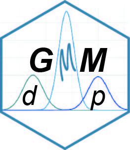

# dpGMM 
R package dpGMM for dynamic programming based Gaussian mixture modelling clustering for 1D and 2D data.

## Description
Package functionality:
1) Variety of criteria for selection component number (AIC, AICc, BIC, ICL-BIC and LR),
2) Posibility of merging the components with a small standard deviation within each other,
3) Control of minimum allow variance of component to avoid picks,
4) Quick stop if LR test does not show improvement (off/on) accompanied by possibility to control significance level,
5) Analysis of single measurements/vector as well as binned data,
6) Distribution plot with selected components in ggplot,
7) QQ-plot of fitted distribution and standard normal distribution,
8) Gaussian Mixture Modeling for 2D data.

## Installation
You can install the package from [GitHub](https://github.com/) with:
``` r
# install.packages("devtools")
devtools::install_github("ZAEDPolSl/dpGMM")
```

## Run of simple data
At first after isnatlation load library into R and load examplary data.
``` r
library(rGMM)
data(example)
```
Next, let's load GMM control parameters for 1D and change maximum number of iteration to 1000 (just to speed up).

``` r
custom.settings <- GMM_1D_opts
custom.settings$max_iter <- 1000
```
To run GMM for 1D vector data the following code will work.
``` r
mix_test <- runGMM(example$Dist, opts = custom.settings)
```

## References
[1] Polanski, Andrzej, et al. "Initializing the EM algorithm for univariate Gaussian, multi-component, heteroscedastic mixture models by dynamic programming partitions." International Journal of Computational Methods 15.03 (2018): 1850012.
